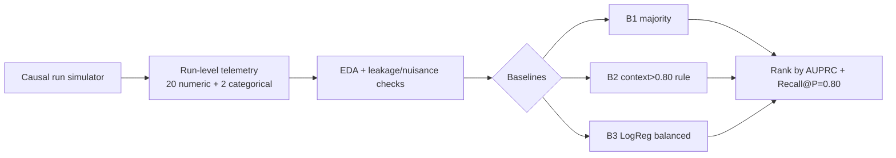

# AI-Agent Failure Predictor

> Predict whether an autonomous LLM-agent run will **fail** from its run-level telemetry —
> and show why the `context_usage > 80%` alert that every observability dashboard ships is
> structurally blind to **84% of failures**.

**Domain:** AI Infra / Agent Observability · **Type:** imbalanced binary classification
(positive = failure, ~26% prevalence) · **Status:** Phase 1 of 7 complete (2026-06-15).

---

## TL;DR (Phase 1)

- Built a **causal, literature-calibrated simulator** of 20,000 agent runs (calibrated to the
  MAST failure taxonomy, TRAIL, and 2026 observability practice). Failure *emerges* from latent
  step dynamics — it is never assigned from a feature (leakage-checked: max single-feature AUC < 0.74).
- **Headline:** **84% of failures occur while context utilization is below 80%.** Retry/cascade
  failures fail at a *mean context of just 0.30* — long before the industry alarm fires.
- The deployed `context > 0.80` rule catches only **15% of failures** at one un-tunable operating
  point. A 1-line balanced **Logistic Regression** lifts AUPRC **+24%** (0.48 → 0.60) and is a
  *dial* (68% recall achievable), not a fixed point.

| Baseline (test) | AUPRC ↑ | ROC-AUC | F1 | Recall@P=0.80 | What it is |
|---|---:|---:|---:|---:|---|
| **B3 Logistic Regression** | **0.599** | **0.773** | 0.548 | 0.197 | learned floor for Phase 2 |
| B2 context score (rule@0.80) | 0.482 | 0.644 | 0.258 | 0.172 | the dashboard alert everyone ships |
| B1 majority class | 0.260 | 0.500 | 0.000 | 0.000 | sanity floor (= prevalence) |


---

## Why this matters

By 2027, >40% of agentic-AI projects are forecast to be cancelled over cost and **monitoring**
gaps. Teams instrument agents and alert on the one number that's easy to read — context window
usage. This project asks whether that number actually predicts failure. It doesn't: agents fail
via **tool-chain cascades and retry loops** that corrupt the run long *before* context saturates.

## The data (honest about synthetic)

No large public *telemetry → outcome* dataset exists — the closest real sets (TRAIL n=148,
Who&When n=127, MAST, TracerTraj-2.5K) are small human-annotated *trace-localization* benchmarks.
So `src/data_pipeline.py` **simulates** runs with a causal step-level process calibrated to those
sources. Each run logs 20 numeric + 2 categorical telemetry features:

`num_steps, context_max_pct, context_growth_rate, max_tool_depth, num_tool_calls, tool_error_rate,
num_retries, max_consecutive_retries, error_count_subtotal, reasoning_loop_count,
tool_calls_per_step, error_rate_per_step, tokens_per_step_growth, …, task_type, model_tier`.

Three design choices keep it from being a toy:
1. **Run length is decoupled from outcome** (avoids step-count leakage).
2. **Outcome is noisy** — a function of observed trouble **+ unobserved capability gaps + Bernoulli
   noise** — so the Bayes-optimal AUPRC is < 1.0 (a "perfect" model would mean leakage).
3. **An exogenous early-failure channel** produces telemetry-light failures (≈24%) that overlap
   with quick successes — the irreducible error real systems have.


## Method



**Primary metric — AUPRC** (imbalanced, positive = failure; ROC-AUC is optimistic at 26%
prevalence). **Operating metric — Recall@Precision=0.80** (catch failures without drowning ops in
false alarms). Every comparison table this week ranks on AUPRC.

## Repo layout
```
src/data_pipeline.py     causal agent-run simulator (the dataset)
src/utils.py             shared metric helpers (evaluate, recall_at_precision)
config/config.yaml       features, metric, paths
notebooks/phase1_eda_baseline.ipynb   executed: EDA + leakage checks + 3 baselines (23 cells)
results/                 metrics.json, EXPERIMENT_LOG.md, phase1_*.png (5 figures)
reports/day1_phase1_report.md         full research write-up
```

## Reproduce
```bash
pip install -r requirements.txt
python -c "from src.data_pipeline import build_and_save; build_and_save()"   # regenerate data
jupyter nbconvert --to notebook --execute --inplace notebooks/phase1_eda_baseline.ipynb
```

## Roadmap
- **Phase 1 ✅** dataset, EDA, leakage checks, 3 baselines (this).
- **Phase 2** RandomForest / XGBoost / LightGBM / CatBoost / GradientBoosting vs the LogReg floor —
  hypothesis: trees win via the *context × tool-depth* and *retry × cascade* interactions.
- **Phase 3** feature engineering (leading indicators: growth rates, sliding windows).
- **Phase 4** tuning + error analysis. **Phase 5** advanced + ablation + **frontier-LLM head-to-head**.
- **Phase 6** explainability (SHAP). **Phase 7** production pipeline + Streamlit dashboard.

## Key findings so far
1. The industry `context > 80%` rule is blind to 84% of failures.
2. Failures are tool-driven (retry + cascade + exogenous ≈ 85%), not context-driven (12.5%).
3. A learned score beats the rule everywhere and gives operators a tunable dial.
4. The achievable ceiling is honest (~0.77 ROC) because ~24% of failures are telemetry-light.

---

## Iteration Summary

### Phase 1: Domain Research + Dataset + EDA + Baselines — 2026-06-15

<table>
<tr>
<td valign="top" width="38%">

**What was tested:** Built a causal, literature-calibrated simulator of 20,000 agent runs and tested whether the industry-standard `context_usage > 80%` alert actually predicts failure — measured against 3 baselines ranked by AUPRC. The deployed rule catches only **15% of failures**; a balanced LogReg lifts AUPRC **+24%** (0.48 → 0.60).<br><br>
**What worked best:** Balanced **Logistic Regression** (AUPRC 0.599) — it dominates the context rule everywhere on the PR curve and, unlike the rule's single fixed point, is a *tunable dial* (68% recall achievable at its default threshold).

</td>
<td align="center" width="24%">


</td>
<td valign="top" width="38%">

**Key Insight:** **84% of all failures occur while context utilization is below 80%** — retry/cascade failures fail at a *mean context of just 0.30*, long before the dashboard alarm fires. Context is a symptom, not the cause.<br><br>
**Surprise:** The first two generator drafts *leaked* (perfect LogReg, AUPRC 1.000) because successes terminated early while only failures accumulated telemetry — a structural confound that required redesigning the outcome model (noisy, latent-driven) to produce realistic class overlap.<br><br>
**Research:** MAST taxonomy (*Why Do Multi-Agent LLM Systems Fail?*, 2025) — failures split Specification 41.8% / Coordination 36.9% / Verification 21.3%, so we tested context saturation as a *minority* cause; TRAIL (Patronus, arXiv:2505.08638) — real failure-trace sets are small & localization-shaped, so we simulated.<br><br>
**Best Model So Far:** B3 Logistic Regression (balanced) — **AUPRC 0.599**, ROC-AUC 0.773.

</td>
</tr>
</table>

---

*Reference quality bar: the Keeper Attractiveness Research (956 raters, 50+ models, 17 phases).*
