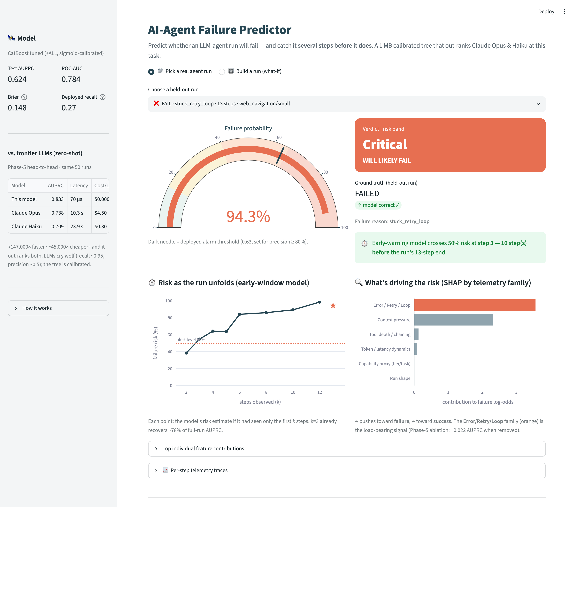
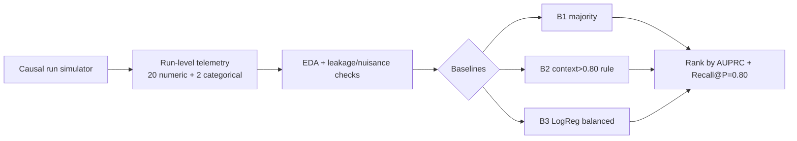
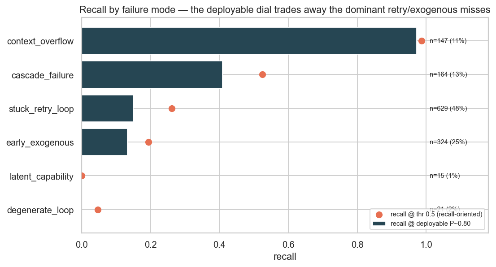
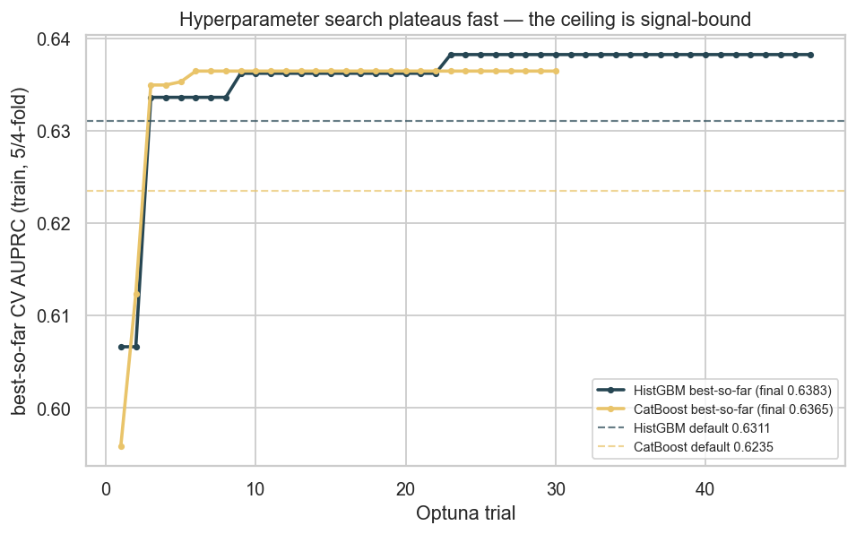
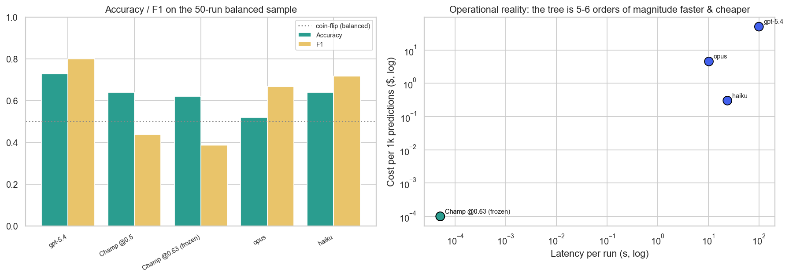

# AI-Agent Failure Predictor

> Predict whether an autonomous LLM-agent run will **fail** from its run-level telemetry —
> and show why the `context_usage > 80%` alert that every observability dashboard ships is
> structurally blind to **84% of failures**.

**Domain:** AI Infra / Agent Observability · **Type:** imbalanced binary classification
(positive = failure, ~26% prevalence) · **Status:** ✅ **Complete — Phase 7 of 7 (2026-06-21).** The five-phase research champion is a 1.1 MB serving artefact (`models/champion.joblib`), reproduced from scratch with **0.00e+00 prediction drift** and asserted in `train.py` (test AUPRC **0.62406**, frozen P≥0.80 threshold 0.632 → P=0.785 R=0.267). It ships behind a **Streamlit dashboard** *and* a **FastAPI service** (`src/serve.py` + `Dockerfile`), scores a run in **~32 µs (batched, ~324,000× faster than Opus)**, explains it by telemetry family (SHAP), and raises the early-window alarm **8–14 steps before** a failing run ends. **47 pytest contracts** lock the generator's no-leakage guarantee, the 49-feature schema, the metric helpers, and the champion's reproduction. Full write-up: [`reports/final_report.md`](reports/final_report.md).



---

## TL;DR (Phase 1)

- Built a **causal, literature-calibrated simulator** of 20,000 agent runs (calibrated to the
  MAST failure taxonomy, TRAIL, and 2026 observability practice). Failure *emerges* from latent
  step dynamics — it is never assigned from a feature (leakage-checked: max single-feature AUC < 0.74).
- **Headline:** **84% of failures occur while context utilization is below 80%.** Retry/cascade
  failures fail at a *mean context of just 0.30* — long before the industry alarm fires.
- The deployed `context > 0.80` rule catches only **15% of failures** at one un-tunable operating
  point. A 1-line balanced **Logistic Regression** lifts AUPRC **+24%** (0.48 → 0.60) and is a
  *dial* (68% recall achievable), not a fixed point.

| Baseline (test) | AUPRC ↑ | ROC-AUC | F1 | Recall@P=0.80 | What it is |
|---|---:|---:|---:|---:|---|
| **B3 Logistic Regression** | **0.599** | **0.773** | 0.548 | 0.197 | learned floor for Phase 2 |
| B2 context score (rule@0.80) | 0.482 | 0.644 | 0.258 | 0.172 | the dashboard alert everyone ships |
| B1 majority class | 0.260 | 0.500 | 0.000 | 0.000 | sanity floor (= prevalence) |


---

## Why this matters

By 2027, >40% of agentic-AI projects are forecast to be cancelled over cost and **monitoring**
gaps. Teams instrument agents and alert on the one number that's easy to read — context window
usage. This project asks whether that number actually predicts failure. It doesn't: agents fail
via **tool-chain cascades and retry loops** that corrupt the run long *before* context saturates.

## The data (honest about synthetic)

No large public *telemetry → outcome* dataset exists — the closest real sets (TRAIL n=148,
Who&When n=127, MAST, TracerTraj-2.5K) are small human-annotated *trace-localization* benchmarks.
So `src/data_pipeline.py` **simulates** runs with a causal step-level process calibrated to those
sources. Each run logs 20 numeric + 2 categorical telemetry features:

`num_steps, context_max_pct, context_growth_rate, max_tool_depth, num_tool_calls, tool_error_rate,
num_retries, max_consecutive_retries, error_count_subtotal, reasoning_loop_count,
tool_calls_per_step, error_rate_per_step, tokens_per_step_growth, …, task_type, model_tier`.

Three design choices keep it from being a toy:
1. **Run length is decoupled from outcome** (avoids step-count leakage).
2. **Outcome is noisy** — a function of observed trouble **+ unobserved capability gaps + Bernoulli
   noise** — so the Bayes-optimal AUPRC is < 1.0 (a "perfect" model would mean leakage).
3. **An exogenous early-failure channel** produces telemetry-light failures (≈24%) that overlap
   with quick successes — the irreducible error real systems have.


## Method



**Primary metric — AUPRC** (imbalanced, positive = failure; ROC-AUC is optimistic at 26%
prevalence). **Operating metric — Recall@Precision=0.80** (catch failures without drowning ops in
false alarms). Every comparison table this week ranks on AUPRC.

## Repo layout
```
src/data_pipeline.py        causal agent-run simulator (the dataset)
src/feature_engineering.py  canonical 49-feature pipeline (base+LEAD+DOM) + early-window + trace synth
src/train.py                deterministic training — reproduces champion + early-window + SHAP twin
src/predict.py              inference: predict_run / predict_batch / explain_run / early_window_curve
src/evaluate.py             held-out metric bundle + latency benchmark + per-reason recall
src/utils.py                shared metric helpers (evaluate, recall_at_precision)
src/serve.py                FastAPI scoring service (/health /predict /predict/whatif /model)
app.py                      Streamlit real-time risk dashboard
Dockerfile                  containerised FastAPI service (trains the model into the image)
config/config.yaml          features, metric, frozen champion + early-window hyperparameters
models/model_card.md        Google/HF-format model card
notebooks/phase{1..5}_*.ipynb   executed research notebooks (EDA → models → FE → tuning → ablation/LLM)
tests/                      47 contract / inference / HTTP tests (generator leakage guard, schema, metrics, serve)
results/                    metrics.json, EXPERIMENT_LOG.md, ui_screenshot.png, phase*_*.png
reports/day{1..7}_*.md      full per-phase research write-ups
reports/final_report.md     consolidated mini research paper (all 7 phases)
```

## Reproduce
```bash
pip install -r requirements.txt
python -m src.train                  # generate data → reproduce champion + early-window (~3 min, asserts AUPRC 0.624)
python -m src.evaluate               # held-out metrics + latency benchmark → results/phase6_eval.json
pytest -q                            # 47 contract / inference / HTTP tests
streamlit run app.py                 # the real-time risk dashboard
uvicorn src.serve:app --port 8000    # the FastAPI scoring service   (or: docker build -t afp . && docker run -p 8000:8000 afp)
```

## Roadmap
- **Phase 1 ✅** dataset, EDA, leakage checks, 3 baselines (this).
- **Phase 2 ✅** RandomForest / XGBoost / LightGBM / CatBoost / Hist-GBM / ExtraTrees vs the LogReg floor.
  Hypothesis (trees win on the interactions) was *half-wrong*: best tree is only +0.019 AUPRC over a
  1-line LogReg, LightGBM loses to the floor — the win is **calibration**, not ranking.
- **Phase 3 ✅** leading-indicator feature engineering (trajectory rate/EWS/latency-tail + early-window).
  The ~0.62 ceiling is *signal-bound* (best lift +0.003); the signal lives in the **trajectory** (rate-only
  recovers 94%), and **failure is visible by step 3** (78% of full-run AUPRC).
- **Phase 4 ✅** Optuna tuning + calibration + error analysis. Tuning adds only +0.003 AUPRC (ceiling holds
  from a 4th angle); the deployable wins are an **honest frozen threshold** and the finding that the miss is
  two parts — a recoverable precision-tradeoff band and a small *irreducible* telemetry-light core.
- **Phase 5 ✅** advanced techniques + ablation + **frontier-LLM head-to-head**. Nothing beat the
  champion: SMOTE/ADASYN *cut* AUPRC, a leak-free 4-learner stack only tied (bases ≥0.92 correlated →
  the ~0.62 ceiling holds a 5th time), the **Error/Retry/Loop** family carries the signal (−0.0222 when
  dropped, 6× the next family), and the **1 MB tree out-ranks Claude Opus & Haiku** on the same 50 runs
  (AUPRC 0.833 vs 0.738 / 0.709) at 5–6 orders of magnitude less latency and cost.
- **Phase 6 ✅** production pipeline (`train`/`predict`/`evaluate`) + **real-time Streamlit dashboard** +
  SHAP explanations + model card. Champion reproduced with **0.00e+00 prediction drift**; ~32 µs/run
  batched inference; the early-window model raises a 50%-risk alarm **8–14 steps before** failing runs end.
- **Phase 7 ✅** testing + consolidation. **47 pytest contracts** (generator no-leakage guard, 49-feature
  schema, metric edge cases, champion reproduction, HTTP surface), a **FastAPI service** (`src/serve.py`)
  + **Dockerfile**, and the consolidated [`reports/final_report.md`](reports/final_report.md). The project
  is complete and reproducible end-to-end.

## Key findings so far
1. The industry `context > 80%` rule is blind to 84% of failures.
2. Failures are tool-driven (retry + cascade + exogenous ≈ 85%), not context-driven (12.5%).
3. A learned score beats the rule everywhere and gives operators a tunable dial.
4. The achievable ceiling is honest (~0.77 ROC) because ~24% of failures are telemetry-light.
5. Across 7 models / 3 paradigms, **model class barely matters** — the best tree (HistGBM) beats a
   1-line LogReg by just +0.019 AUPRC and LightGBM loses to it; the real differentiator is
   **calibration** (Brier 0.148 vs 0.190), which lifts Recall@P=0.80 +29% rel.
6. **Feature engineering can't break the ceiling either** — 23 hand-built leading indicators move the
   best model by +0.003 AUPRC; they only help *weaker* models catch up (trees already reconstruct the
   interactions). The ceiling is signal-bound, not feature-bound.
7. **The failure signal is in the trajectory, not the endpoint** — rate/shape features alone recover
   **94%** of the AUPRC, which is *why* early prediction works: the **first 3 steps recover 78%** of the
   full-run AUPRC — equal to the full-run accuracy of the industry `context>0.80` alarm.
8. **A 1 MB calibrated tree out-ranks frontier LLMs at failure prediction** — on the same 50 agent runs
   it beats zero-shot Claude Opus and Haiku on AUPRC (**0.833** vs 0.738 / 0.709) at ~147,000× / 341,000×
   the speed and 45,000× / 3,000× the cost; the LLMs *cry wolf* (0.92–0.96 recall, ~0.5 precision —
   uncalibrated). And advanced techniques can't break the ceiling either — SMOTE/ADASYN *cut* AUPRC and
   a 4-learner OOF stack only ties (bases ≥0.92 correlated), so the ~0.62 ceiling now holds from **five**
   independent angles (generator → model class → features → Optuna → ensembling).

---

## Iteration Summary

### Phase 1: Domain Research + Dataset + EDA + Baselines — 2026-06-15

<table>
<tr>
<td valign="top" width="38%">

**What was tested:** Built a causal, literature-calibrated simulator of 20,000 agent runs and tested whether the industry-standard `context_usage > 80%` alert actually predicts failure — measured against 3 baselines ranked by AUPRC. The deployed rule catches only **15% of failures**; a balanced LogReg lifts AUPRC **+24%** (0.48 → 0.60).<br><br>
**What worked best:** Balanced **Logistic Regression** (AUPRC 0.599) — it dominates the context rule everywhere on the PR curve and, unlike the rule's single fixed point, is a *tunable dial* (68% recall achievable at its default threshold).

</td>
<td align="center" width="24%">


</td>
<td valign="top" width="38%">

**Key Insight:** **84% of all failures occur while context utilization is below 80%** — retry/cascade failures fail at a *mean context of just 0.30*, long before the dashboard alarm fires. Context is a symptom, not the cause.<br><br>
**Surprise:** The first two generator drafts *leaked* (perfect LogReg, AUPRC 1.000) because successes terminated early while only failures accumulated telemetry — a structural confound that required redesigning the outcome model (noisy, latent-driven) to produce realistic class overlap.<br><br>
**Research:** MAST taxonomy (*Why Do Multi-Agent LLM Systems Fail?*, 2025) — failures split Specification 41.8% / Coordination 36.9% / Verification 21.3%, so we tested context saturation as a *minority* cause; TRAIL (Patronus, arXiv:2505.08638) — real failure-trace sets are small & localization-shaped, so we simulated.<br><br>
**Best Model So Far:** B3 Logistic Regression (balanced) — **AUPRC 0.599**, ROC-AUC 0.773.

</td>
</tr>
</table>

### Phase 2: Multi-Model Head-to-Head — 2026-06-16

<table>
<tr>
<td valign="top" width="38%">

**What was tested:** 7 models across 3 paradigms (boosting / bagging / linear), 5-fold CV + held-out test, all ranked on AUPRC, vs the Phase-1 LogReg floor (0.599) — does boosting crush it as the Phase-1 "0.68 probe" suggested? Result: the best tree (**HistGBM**) reaches **0.6175, only +0.019 over a 1-line LogReg**, and all 7 bunch in a **0.022 AUPRC band** with near-superimposed PR curves.<br><br>
**What worked best:** **HistGBM** — but it earns the crown on **calibration**, not ranking: Brier **0.148** vs LogReg's 0.190, lifting **Recall@P=0.80 from 0.197 → 0.255 (+29% rel)**. It's the only model that's both top-ranked *and* honestly thresholdable.

</td>
<td align="center" width="24%">


</td>
<td valign="top" width="38%">

**Key Insight:** **Model class barely matters — the bottleneck is signal, not the algorithm.** The ~0.62 AUPRC / ~0.78 ROC ceiling is set by *irreducible latent factors* baked into the generator (latent difficulty−competence, Bernoulli noise, ~24% telemetry-light failures), not the model family.<br><br>
**Surprise:** "Boosting > bagging > linear" is **false** here — boosting holds both #1 (HistGBM) *and* #7 (LightGBM, which loses to the linear floor); a bagging model (ExtraTrees) outranks three boosters. The Phase-1 0.68 probe did not replicate under honest evaluation.<br><br>
**Research:** Springer 2025 (20 models / 111 datasets) & TALENT (300+ datasets) — GBDTs match-or-beat deep nets on tabular, so we ran a 7-model lineup; "top" turned out to mean +0.02, not a landslide. *Canonical Path Deviation as a Causal Mechanism of Agent Failure* (arXiv 2602.19008) — frames cascade/drift as the causal mechanism, motivating the interaction probe (LogReg + 2 interactions recovers 42% of the gap).<br><br>
**Best Model So Far:** **HistGBM** (boosting) — AUPRC **0.6175**, ROC-AUC 0.782, Brier **0.148**, Recall@P=0.80 **0.255**.

</td>
</tr>
</table>

### Phase 3: Feature Engineering on the Leading Edge — 2026-06-17

<table>
<tr>
<td valign="top" width="38%">

**What was tested:** Can engineered *leading-indicator* features break the ~0.62 AUPRC ceiling? Extended the simulator to emit per-step traces (zero RNG impact — aggregates byte-identical to the committed parquet), then engineered **16 trajectory/EWS/latency-tail (LEAD)** + **7 domain-interaction (DOM)** features and ran {FS0 · +LEAD · +DOM · +ALL} × top-3 models on the identical split.<br><br>
**What worked best:** **CatBoost + ALL** nudged the project-best to **0.6208** (+0.003 over the Phase-2 champion) — but the *strongest* model (HistGBM) barely moved. The lift concentrates on weaker models; trees already reconstruct the interactions from raw telemetry.

</td>
<td align="center" width="24%">


</td>
<td valign="top" width="38%">

**Key Insight:** **The signal is in the trajectory, not the endpoint** — rate-only features recover **94%** of the AUPRC. That is *why* early prediction works: using **only the first 3 steps** of a ~11-step run, the model recovers **78%** of the full-run AUPRC (0.482) — *equal to the full-run accuracy of the industry `context>0.80` alarm* (0.4825), which only fires with complete hindsight.<br><br>
**Surprise:** the explicit interaction `ix_retry_casc` is the single strongest feature in the whole pool (univariate AUC 0.739) — above the best raw feature — yet adds ~0 to gradient-boosted trees. And a borrowed-from-ecology **early-warning signal** (lag-1 autocorrelation of the error trace, "critical slowing down") lands in the top-10 by permutation importance.<br><br>
**Research:** EWS theory (Scheffer; EWSNet) for variance/autocorrelation precursors; time-series→tabular FE (arXiv 2303.16117) for velocity/acceleration features; 2025-26 LLM-observability practice (latency-tail creep, retry-exhaustion) for the leading indicators to engineer.<br><br>
**Best Model So Far:** **CatBoost + ALL** — AUPRC **0.6208**; HistGBM remains the best operating point (Recall@P=0.80 **0.255**). Both go into Phase-4 tuning.

</td>
</tr>
</table>

### Phase 4: Hyperparameter Optimization, Calibration & Error Analysis — 2026-06-18

<table>
<tr>
<td valign="top" width="38%">

**What was tested:** Does Optuna (TPE) break the ~0.62 ceiling, and what is actually *deployable* once it's conceded? Tuned both contenders on `+ALL` over research-informed ranges, selecting on **train-only CV** (no test leakage), then scored once on test; calibrated the champion; froze the operating threshold on held-out data; and ran a full error analysis.<br><br>
**What worked best:** **CatBoost tuned** is the new project-best at **0.6237** — but that is only **+0.003** over its own default and +0.007 over the Phase-2 incumbent. TPE independently walked toward *strong regularization* (depth 4, lr 0.025), re-deriving the "simpler is better here" lesson. The ceiling holds from a fourth angle.

</td>
<td align="center" width="24%">


<br>

</td>
<td valign="top" width="38%">

**Key Insight:** The residual error is **two distinct things**. (1) A large *recoverable* band — at the high-precision operating point the model catches only the *loud* failures (`context_overflow` 97%) and misses the quiet ones (`stuck_retry_loop`, 48% of failures, recall 0.15), but dropping the threshold recovers them (0.15→0.26). (2) A small *irreducible* core — `latent_capability` is caught **0% at any threshold**. Only the second is the 0.62 ceiling.<br><br>
**Surprise / correction:** my going-in hypothesis (misses = telemetry-light *reasons*) was wrong — misses are governed by telemetry **magnitude**: false negatives are statistically indistinguishable from successes on every signal (retries 1.6 vs 4.6 for caught). The blind spot is the **frontier-model** (recall 5%) / low-tool-intensity (`multi_hop_qa` 1%) regime — rare, surprising, quiet failures. Also: calibrating the *tuned* tree is a **no-op** (raw Brier 0.147 already best) — counter to the reflex.<br><br>
**Research:** Optuna/TPE diminishing-returns practice; scikit-learn calibration guide + imbalanced-calibration (sigmoid vs isotonic); precision-recall threshold selection on held-out data.<br><br>
**Best Model So Far:** **CatBoost tuned + ALL** — AUPRC **0.6237**, Brier 0.147; honest deployable point **P=0.785 / R=0.267** at a frozen threshold. Goes into the Phase-5 LLM head-to-head.

</td>
</tr>
</table>

### Phase 5: Advanced Techniques, Ablation & the Frontier-LLM Head-to-Head — 2026-06-19

<table>
<tr>
<td valign="top" width="38%">

**What was tested:** Five skeptic's stress-tests of the Phase-4 champion — a SMOTE/ADASYN/reweight imbalance ablation, a leak-free out-of-fold stacking ensemble, a mechanistic group ablation, and the headline: **Claude Opus, Claude Haiku, and Codex (GPT-5.4) zero-shot vs the 1 MB calibrated CatBoost** on the *same* 50-run stratified sample. **Nothing beat the plain champion** (AUPRC 0.6237).<br><br>
**What worked best:** Still the **calibrated CatBoost `+ALL`** — and on the identical 50 rows it **out-ranks both Claude models** (AUPRC **0.833** vs Opus 0.738 / Haiku 0.709) at ~70 µs/run and $0.0001/1k.

</td>
<td align="center" width="24%">



</td>
<td valign="top" width="38%">

**Key Insight:** A **1 MB calibrated tree beats frontier LLMs at ranking agent-failure risk** on quiet telemetry — at **~147,000× / 341,000×** the speed of Opus / Haiku and **45,000× / 3,000×** the cost. The LLMs *cry wolf* (recall 0.92–0.96, precision 0.51–0.59 — uncalibrated). This is the difference between a predictor you can run on *every step of every agent* and one you can't.<br><br>
**Surprise:** **SMOTE/ADASYN made it worse** (−0.011 to −0.013 CV AUPRC — they interpolate synthetic failures straight into the class overlap), reweighting wrecked calibration (Brier 0.18 vs 0.147), and a 4-learner stack tied the champion to 4 decimals (bases ≥0.92 correlated) — the **~0.62 ceiling held a 5th time**, now via ensembling. Twist: model + LLM *together* (route only the tree's borderline cases to Opus) beat either alone (0.72 acc, exploratory).<br><br>
**Research:** Elor & Averbuch-Elor, 2022 (*"To SMOTE, or not to SMOTE?"*) — synthetic oversampling hurts already-calibrated learners on overlapping classes, so we read the cost off precision + Brier rather than recall@0.5; Wolpert, 1992 (*Stacked Generalization*) — stacking needs decorrelated bases, and a correlation check confirmed we lacked them (all ≥0.92).<br><br>
**Best Model So Far:** **CatBoost tuned `+ALL`** — AUPRC **0.6237**, Brier 0.147; unbeaten across generator → model class → features → Optuna → **ensembling**, and out-ranks Opus/Haiku on equal rows. Goes into the Phase-6 production pipeline + dashboard.

</td>
</tr>
</table>

### Phase 6: Production Pipeline + Real-Time Risk Dashboard — 2026-06-20

<table>
<tr>
<td valign="top" width="38%">

**What was built:** the five-phase research champion, packaged for serving without drift. The notebook feature code was lifted into one canonical module (`feature_engineering.py`), `train.py` rebuilds the champion deterministically (frozen Optuna params — no tuning at deploy time) with a **reproduction assert**, and `predict.py`/`evaluate.py` expose scoring + a latency benchmark. A polished **Streamlit dashboard** scores a run live: risk gauge, SHAP-by-telemetry-family, and an **early-window "failure in N steps"** timeline.<br><br>
**Reproduction:** rebuilt from scratch in 212 s → test **AUPRC 0.62406**, frozen threshold **0.632** (P=0.785 / R=0.267) — identical to Phase 4, with **`max|Δproba| = 0.00e+00`** vs the cached champion.

</td>
<td align="center" width="24%">


</td>
<td valign="top" width="38%">

**Headline number (latency):** **~32 µs/run batched** (~31,500 rows/s) on a laptop CPU — **≈324,000× faster than Claude Opus zero-shot** (10.3 s/call), the real figure behind the cost/speed story.<br><br>
**The product:** the early-window model raises a **50%-risk alarm 8–14 steps before** failing runs end (k=3 already recovers 76% of full-run AUPRC). SHAP attributes risk to the **Error/Retry/Loop** family (the load-bearing signal, −0.022 AUPRC when ablated).<br><br>
**Honest by design:** the model card + dashboard footer ship the per-reason recall — context_overflow **0.97**, cascade 0.41, retry 0.15, and the irreducible `latent_capability` core at **0.00 at any threshold**. No aggregate hides the blind spot.<br><br>
**Research:** Mitchell et al. 2019 (Model Cards); Niculescu-Mizil & Caruana 2005 (Platt calibration is a monotone post-map → SHAP twin is valid); Scheffer et al. 2009 (critical-slowing-down early-warning → the lead-time timeline).<br><br>
**Best Model:** unchanged — **CatBoost tuned `+ALL`**, now a 1.1 MB serving artefact with a frozen threshold and an early-window companion. Phase 7: tests + final consolidation.

</td>
</tr>
</table>

### Phase 7: Testing, Serving & Consolidation — 2026-06-21

<table>
<tr>
<td valign="top" width="38%">

**What was built:** the credibility layer. The pytest suite grew **14 → 47** tests across six files — generator invariants + a **single-feature no-leakage guard** (`max AUC < 0.85`, the test that would have caught the Phase-1 leak), the byte-identical trace/aggregate guarantee, the 49-feature schema + single-row dummy encoding, metric-helper edge cases (unreachable precision → `None` threshold), champion **reproduction** (held-out AUPRC within 0.01 of 0.624), and the HTTP surface. Added a **FastAPI service** (`src/serve.py`) reusing the exact `predict` functions (no serving skew) and a **Dockerfile** that trains the model into the image. Consolidated all 7 phases into [`reports/final_report.md`](reports/final_report.md).<br><br>
**Verification:** `python -m src.train` reproduced the champion to **AUPRC 0.62406 / threshold 0.6323** (asserts pass); all **47 tests green**; the FastAPI `/predict/whatif` scores a trouble run at **P(fail)=0.896 [Critical]** with an early-warning alert.

</td>
<td align="center" width="24%">


</td>
<td valign="top" width="38%">

**Key Insight (the consolidation thesis):** almost all the available lift is in *replacing the rule with any learned score* — industry `context>0.80` rule (AUPRC 0.48) → 1-line LogReg (0.60) is **+24%**; LogReg → fully-tuned, feature-engineered, ensembled champion (0.62) is **+4%**. The sophistication after the first learned model is nearly free; the regime change is the baseline swap.<br><br>
**Honest by design:** model-dependent tests **skip cleanly** when the gitignored artefacts are absent, so CI stays green without shipping a 58 MB model; the leakage guard and reproduction asserts live in code, not prose.<br><br>
**Research:** standard ML-engineering practice — HF/Google **Model Cards** (Mitchell et al. 2019), train/serve-skew avoidance (one canonical featuriser), and contract testing of the data generator (the leakage guard is the project's load-bearing test).<br><br>
**Final state:** complete, reproducible end-to-end (`train` → `evaluate` → `pytest` → `streamlit`/`uvicorn`/`docker`). Champion unchanged: **CatBoost tuned `+ALL`**, AUPRC **0.624**, out-ranks Opus & Haiku at ~32 µs/run.

</td>
</tr>
</table>

---

*Reference quality bar: the Keeper Attractiveness Research (956 raters, 50+ models, 17 phases).*
