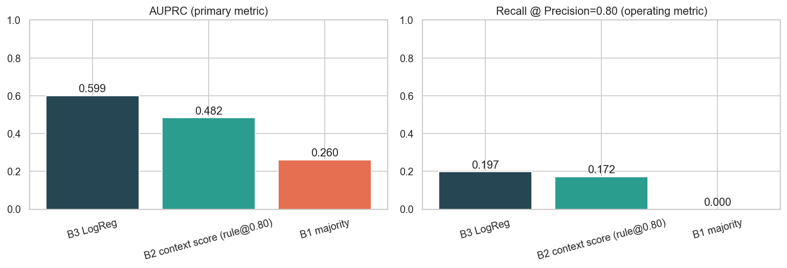
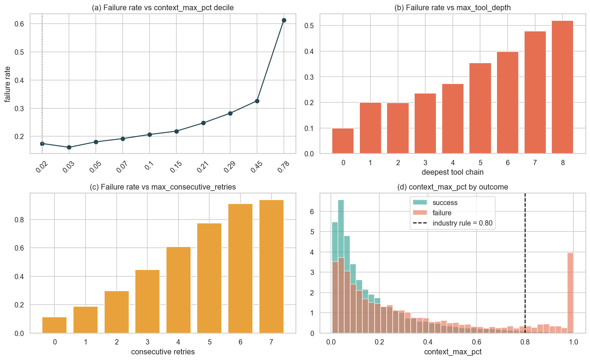
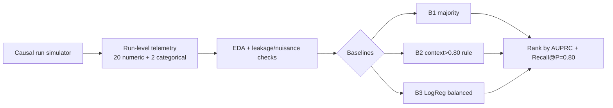
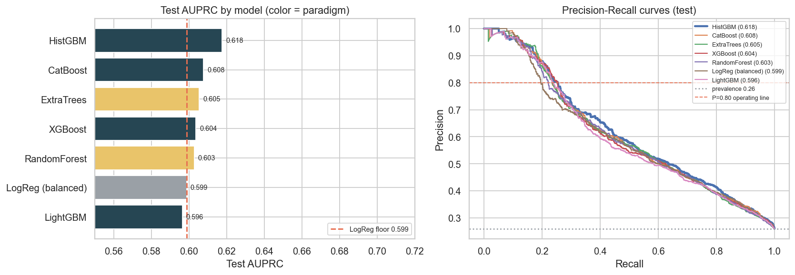
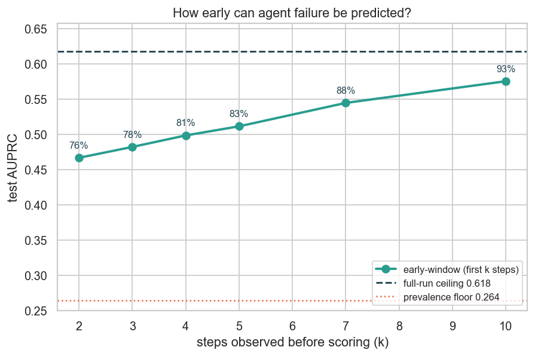

# AI-Agent Failure Predictor

> Predict whether an autonomous LLM-agent run will **fail** from its run-level telemetry —
> and show why the `context_usage > 80%` alert that every observability dashboard ships is
> structurally blind to **84% of failures**.

**Domain:** AI Infra / Agent Observability · **Type:** imbalanced binary classification
(positive = failure, ~26% prevalence) · **Status:** Phase 3 of 7 complete (2026-06-17) — engineered leading-indicator features; the ~0.62 AUPRC ceiling is **signal-bound** (best lift +0.003), and **78% of the full-run signal is available at step 3** of a ~11-step run.

---

## TL;DR (Phase 1)

- Built a **causal, literature-calibrated simulator** of 20,000 agent runs (calibrated to the
  MAST failure taxonomy, TRAIL, and 2026 observability practice). Failure *emerges* from latent
  step dynamics — it is never assigned from a feature (leakage-checked: max single-feature AUC < 0.74).
- **Headline:** **84% of failures occur while context utilization is below 80%.** Retry/cascade
  failures fail at a *mean context of just 0.30* — long before the industry alarm fires.
- The deployed `context > 0.80` rule catches only **15% of failures** at one un-tunable operating
  point. A 1-line balanced **Logistic Regression** lifts AUPRC **+24%** (0.48 → 0.60) and is a
  *dial* (68% recall achievable), not a fixed point.

| Baseline (test) | AUPRC ↑ | ROC-AUC | F1 | Recall@P=0.80 | What it is |
|---|---:|---:|---:|---:|---|
| **B3 Logistic Regression** | **0.599** | **0.773** | 0.548 | 0.197 | learned floor for Phase 2 |
| B2 context score (rule@0.80) | 0.482 | 0.644 | 0.258 | 0.172 | the dashboard alert everyone ships |
| B1 majority class | 0.260 | 0.500 | 0.000 | 0.000 | sanity floor (= prevalence) |



---

## Why this matters

By 2027, >40% of agentic-AI projects are forecast to be cancelled over cost and **monitoring**
gaps. Teams instrument agents and alert on the one number that's easy to read — context window
usage. This project asks whether that number actually predicts failure. It doesn't: agents fail
via **tool-chain cascades and retry loops** that corrupt the run long *before* context saturates.

## The data (honest about synthetic)

No large public *telemetry → outcome* dataset exists — the closest real sets (TRAIL n=148,
Who&When n=127, MAST, TracerTraj-2.5K) are small human-annotated *trace-localization* benchmarks.
So `src/data_pipeline.py` **simulates** runs with a causal step-level process calibrated to those
sources. Each run logs 20 numeric + 2 categorical telemetry features:

`num_steps, context_max_pct, context_growth_rate, max_tool_depth, num_tool_calls, tool_error_rate,
num_retries, max_consecutive_retries, error_count_subtotal, reasoning_loop_count,
tool_calls_per_step, error_rate_per_step, tokens_per_step_growth, …, task_type, model_tier`.

Three design choices keep it from being a toy:
1. **Run length is decoupled from outcome** (avoids step-count leakage).
2. **Outcome is noisy** — a function of observed trouble **+ unobserved capability gaps + Bernoulli
   noise** — so the Bayes-optimal AUPRC is < 1.0 (a "perfect" model would mean leakage).
3. **An exogenous early-failure channel** produces telemetry-light failures (≈24%) that overlap
   with quick successes — the irreducible error real systems have.



## Method



**Primary metric — AUPRC** (imbalanced, positive = failure; ROC-AUC is optimistic at 26%
prevalence). **Operating metric — Recall@Precision=0.80** (catch failures without drowning ops in
false alarms). Every comparison table this week ranks on AUPRC.

## Repo layout
```
src/data_pipeline.py     causal agent-run simulator (the dataset)
src/utils.py             shared metric helpers (evaluate, recall_at_precision)
config/config.yaml       features, metric, paths
notebooks/phase1_eda_baseline.ipynb   executed: EDA + leakage checks + 3 baselines (23 cells)
results/                 metrics.json, EXPERIMENT_LOG.md, phase1_*.png (5 figures)
reports/day1_phase1_report.md         full research write-up
```

## Reproduce
```bash
pip install -r requirements.txt
python -c "from src.data_pipeline import build_and_save; build_and_save()"   # regenerate data
jupyter nbconvert --to notebook --execute --inplace notebooks/phase1_eda_baseline.ipynb
```

## Roadmap
- **Phase 1 ✅** dataset, EDA, leakage checks, 3 baselines (this).
- **Phase 2 ✅** RandomForest / XGBoost / LightGBM / CatBoost / Hist-GBM / ExtraTrees vs the LogReg floor.
  Hypothesis (trees win on the interactions) was *half-wrong*: best tree is only +0.019 AUPRC over a
  1-line LogReg, LightGBM loses to the floor — the win is **calibration**, not ranking.
- **Phase 3 ✅** leading-indicator feature engineering (trajectory rate/EWS/latency-tail + early-window).
  The ~0.62 ceiling is *signal-bound* (best lift +0.003); the signal lives in the **trajectory** (rate-only
  recovers 94%), and **failure is visible by step 3** (78% of full-run AUPRC).
- **Phase 4** tuning + error analysis. **Phase 5** advanced + ablation + **frontier-LLM head-to-head**.
- **Phase 6** explainability (SHAP). **Phase 7** production pipeline + Streamlit dashboard.

## Key findings so far
1. The industry `context > 80%` rule is blind to 84% of failures.
2. Failures are tool-driven (retry + cascade + exogenous ≈ 85%), not context-driven (12.5%).
3. A learned score beats the rule everywhere and gives operators a tunable dial.
4. The achievable ceiling is honest (~0.77 ROC) because ~24% of failures are telemetry-light.
5. Across 7 models / 3 paradigms, **model class barely matters** — the best tree (HistGBM) beats a
   1-line LogReg by just +0.019 AUPRC and LightGBM loses to it; the real differentiator is
   **calibration** (Brier 0.148 vs 0.190), which lifts Recall@P=0.80 +29% rel.
6. **Feature engineering can't break the ceiling either** — 23 hand-built leading indicators move the
   best model by +0.003 AUPRC; they only help *weaker* models catch up (trees already reconstruct the
   interactions). The ceiling is signal-bound, not feature-bound.
7. **The failure signal is in the trajectory, not the endpoint** — rate/shape features alone recover
   **94%** of the AUPRC, which is *why* early prediction works: the **first 3 steps recover 78%** of the
   full-run AUPRC — equal to the full-run accuracy of the industry `context>0.80` alarm.

---

## Iteration Summary

### Phase 1: Domain Research + Dataset + EDA + Baselines — 2026-06-15

<table>
<tr>
<td valign="top" width="38%">

**What was tested:** Built a causal, literature-calibrated simulator of 20,000 agent runs and tested whether the industry-standard `context_usage > 80%` alert actually predicts failure — measured against 3 baselines ranked by AUPRC. The deployed rule catches only **15% of failures**; a balanced LogReg lifts AUPRC **+24%** (0.48 → 0.60).<br><br>
**What worked best:** Balanced **Logistic Regression** (AUPRC 0.599) — it dominates the context rule everywhere on the PR curve and, unlike the rule's single fixed point, is a *tunable dial* (68% recall achievable at its default threshold).

</td>
<td align="center" width="24%">


</td>
<td valign="top" width="38%">

**Key Insight:** **84% of all failures occur while context utilization is below 80%** — retry/cascade failures fail at a *mean context of just 0.30*, long before the dashboard alarm fires. Context is a symptom, not the cause.<br><br>
**Surprise:** The first two generator drafts *leaked* (perfect LogReg, AUPRC 1.000) because successes terminated early while only failures accumulated telemetry — a structural confound that required redesigning the outcome model (noisy, latent-driven) to produce realistic class overlap.<br><br>
**Research:** MAST taxonomy (*Why Do Multi-Agent LLM Systems Fail?*, 2025) — failures split Specification 41.8% / Coordination 36.9% / Verification 21.3%, so we tested context saturation as a *minority* cause; TRAIL (Patronus, arXiv:2505.08638) — real failure-trace sets are small & localization-shaped, so we simulated.<br><br>
**Best Model So Far:** B3 Logistic Regression (balanced) — **AUPRC 0.599**, ROC-AUC 0.773.

</td>
</tr>
</table>

### Phase 2: Multi-Model Head-to-Head — 2026-06-16

<table>
<tr>
<td valign="top" width="38%">

**What was tested:** 7 models across 3 paradigms (boosting / bagging / linear), 5-fold CV + held-out test, all ranked on AUPRC, vs the Phase-1 LogReg floor (0.599) — does boosting crush it as the Phase-1 "0.68 probe" suggested? Result: the best tree (**HistGBM**) reaches **0.6175, only +0.019 over a 1-line LogReg**, and all 7 bunch in a **0.022 AUPRC band** with near-superimposed PR curves.<br><br>
**What worked best:** **HistGBM** — but it earns the crown on **calibration**, not ranking: Brier **0.148** vs LogReg's 0.190, lifting **Recall@P=0.80 from 0.197 → 0.255 (+29% rel)**. It's the only model that's both top-ranked *and* honestly thresholdable.

</td>
<td align="center" width="24%">



</td>
<td valign="top" width="38%">

**Key Insight:** **Model class barely matters — the bottleneck is signal, not the algorithm.** The ~0.62 AUPRC / ~0.78 ROC ceiling is set by *irreducible latent factors* baked into the generator (latent difficulty−competence, Bernoulli noise, ~24% telemetry-light failures), not the model family.<br><br>
**Surprise:** "Boosting > bagging > linear" is **false** here — boosting holds both #1 (HistGBM) *and* #7 (LightGBM, which loses to the linear floor); a bagging model (ExtraTrees) outranks three boosters. The Phase-1 0.68 probe did not replicate under honest evaluation.<br><br>
**Research:** Springer 2025 (20 models / 111 datasets) & TALENT (300+ datasets) — GBDTs match-or-beat deep nets on tabular, so we ran a 7-model lineup; "top" turned out to mean +0.02, not a landslide. *Canonical Path Deviation as a Causal Mechanism of Agent Failure* (arXiv 2602.19008) — frames cascade/drift as the causal mechanism, motivating the interaction probe (LogReg + 2 interactions recovers 42% of the gap).<br><br>
**Best Model So Far:** **HistGBM** (boosting) — AUPRC **0.6175**, ROC-AUC 0.782, Brier **0.148**, Recall@P=0.80 **0.255**.

</td>
</tr>
</table>

### Phase 3: Feature Engineering on the Leading Edge — 2026-06-17

<table>
<tr>
<td valign="top" width="38%">

**What was tested:** Can engineered *leading-indicator* features break the ~0.62 AUPRC ceiling? Extended the simulator to emit per-step traces (zero RNG impact — aggregates byte-identical to the committed parquet), then engineered **16 trajectory/EWS/latency-tail (LEAD)** + **7 domain-interaction (DOM)** features and ran {FS0 · +LEAD · +DOM · +ALL} × top-3 models on the identical split.<br><br>
**What worked best:** **CatBoost + ALL** nudged the project-best to **0.6208** (+0.003 over the Phase-2 champion) — but the *strongest* model (HistGBM) barely moved. The lift concentrates on weaker models; trees already reconstruct the interactions from raw telemetry.

</td>
<td align="center" width="24%">



</td>
<td valign="top" width="38%">

**Key Insight:** **The signal is in the trajectory, not the endpoint** — rate-only features recover **94%** of the AUPRC. That is *why* early prediction works: using **only the first 3 steps** of a ~11-step run, the model recovers **78%** of the full-run AUPRC (0.482) — *equal to the full-run accuracy of the industry `context>0.80` alarm* (0.4825), which only fires with complete hindsight.<br><br>
**Surprise:** the explicit interaction `ix_retry_casc` is the single strongest feature in the whole pool (univariate AUC 0.739) — above the best raw feature — yet adds ~0 to gradient-boosted trees. And a borrowed-from-ecology **early-warning signal** (lag-1 autocorrelation of the error trace, "critical slowing down") lands in the top-10 by permutation importance.<br><br>
**Research:** EWS theory (Scheffer; EWSNet) for variance/autocorrelation precursors; time-series→tabular FE (arXiv 2303.16117) for velocity/acceleration features; 2025-26 LLM-observability practice (latency-tail creep, retry-exhaustion) for the leading indicators to engineer.<br><br>
**Best Model So Far:** **CatBoost + ALL** — AUPRC **0.6208**; HistGBM remains the best operating point (Recall@P=0.80 **0.255**). Both go into Phase-4 tuning.

</td>
</tr>
</table>

---

*Reference quality bar: the Keeper Attractiveness Research (956 raters, 50+ models, 17 phases).*
