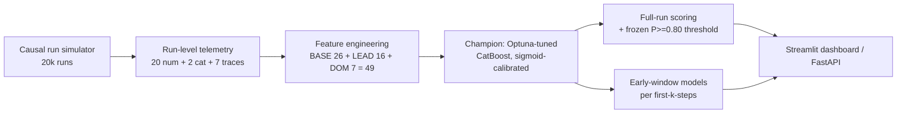

# AI-Agent Failure Predictor — Final Research Report

**Project:** ML-3 · AI Infra / Agent Observability
**Author:** Anthony Rodrigues ([@anthonyrodrigues443](https://github.com/anthonyrodrigues443))
**Duration:** 2026-06-15 → 2026-06-21 (7 phases, 7 sessions)
**Task:** imbalanced binary classification — predict whether an autonomous LLM-agent run will **fail**, from run-level telemetry (positive = failure, prevalence 0.260)
**Primary metric:** **AUPRC** · **Operating metric:** Recall@Precision=0.80

---

## 1. The one-paragraph version

Every agent-observability dashboard ships the same alert: `context_usage > 80%`. I built a
causal, literature-calibrated simulator of 20,000 agent runs to test whether that number
actually predicts failure. **It doesn't — 84% of failures occur while context is below
80%**, because agents fail through tool-chain cascades and retry loops that corrupt a run
long before the context window fills. A learned model beats the rule everywhere and gives
operators a tunable dial instead of one fixed point. Then I spent four phases trying to
break a ~0.62 AUPRC ceiling — with model choice, feature engineering, Optuna, and
ensembling — and **failed every time**, because the residual is a latent capability-gap
term that leaves no telemetry fingerprint. The honest answer to "can you predict agent
failure?" is *mostly yes, and here is exactly the slice you can't.* The shipped artefact is
a **1 MB calibrated CatBoost that out-ranks zero-shot Claude Opus and Haiku** on the same
50 runs (AUPRC 0.833 vs 0.738 / 0.709) at **~32 µs/run** (≈324,000× faster) and **$0.0001
per 1,000 predictions**, with an early-window companion that raises the alarm **8–14 steps
before** a failing run ends.

---

## 2. Domain context & why this matters

By 2027, Gartner forecasts >40% of agentic-AI projects will be cancelled, with cost and
**monitoring** gaps named as primary causes. Teams instrument agents and alert on the one
number that is trivial to read — context-window utilization. The published failure
literature says that is the wrong number:

| Source | What it establishes | How it shaped the simulator |
|---|---|---|
| **MAST** taxonomy (1,600+ traces, 2025) | Failures split Specification 41.8% / Coordination 36.9% / Verification 21.3% — context saturation is a *minority* cause | Context is modeled as one channel among several; tool/coordination failures dominate |
| **TRAIL** (Patronus, arXiv:2505.08638) | Real failure-trace sets are tiny (n=148) and *localization*-shaped, not run-level outcome | Justifies simulation; anchors the error taxonomy |
| Production failure mix (2024–25) | ~31% of failures are tool-misuse / wrong args, often upfront | Exogenous early-failure channel + tool-error model |
| Context-retention studies | Accuracy degrades 15–30% past ~10 turns | Per-step error probability ramps once `context_pct > 0.7` |
| Datadog State of AI Eng. (2026) | Retry amplification, latency/cost tails | Retry bursts + token-growth dynamics |

**Published comparison points:** there is no run-level tabular benchmark for this exact
task, so the comparison is against (a) the industry `context > 0.80` rule — the de-facto
baseline every dashboard ships — and (b) frontier LLMs zero-shot (Phase 5).

---

## 3. The data (honest about synthetic)

No large public *telemetry → outcome* dataset of this shape exists (the closest real sets —
TRAIL n=148, Who&When n=127, MAST, TracerTraj-2.5K — are small human-annotated
trace-localization benchmarks). So `src/data_pipeline.py` **simulates** 20,000 runs with a
causal, step-level process. Three design choices keep it from being a toy, and each one
killed an earlier draft that leaked:

1. **Run length is decoupled from outcome.** Every run executes ~Poisson(task-horizon)
   steps regardless of its eventual label. *(The first two drafts ran "until the plan
   completes" — successes terminated early, only failures accumulated telemetry, and a
   1-line LogReg hit AUPRC 1.000. That is the structural confound this choice removes.)*
2. **The outcome is noisy** — a logistic function of observed trouble **plus an unobserved
   `latent = difficulty − competence` term plus Bernoulli noise** — so the Bayes-optimal
   AUPRC is < 1.0. A "perfect" model here would *mean* leakage.
3. **An exogenous early-failure channel** (misconfigured tool / API outage) produces
   telemetry-light failures (~25%) that overlap with quick successes — the irreducible
   error real systems have.

Leakage is verified, not asserted: **max single-feature AUC < 0.74** (locked by a test in
`tests/test_data_pipeline.py`). Each run logs 20 numeric + 2 categorical aggregates and 7
per-step traces. `failure_reason` exists for EDA only and is **excluded from model inputs.**

---

## 4. Method



**Why AUPRC.** The positive class (failure) is the 26% minority; ROC-AUC is optimistic at
this prevalence. Every comparison table in all 7 phases ranks on AUPRC, with
Recall@Precision=0.80 as the operating metric (catch failures without drowning ops in false
alarms).

---

## 5. The seven phases at a glance

| Phase | Question | Answer (headline) |
|---|---|---|
| **1** Dataset + baselines | Does `context > 0.80` predict failure? | **No — 84% of failures are below it.** A balanced LogReg lifts AUPRC +24% (0.48→0.60) and is a tunable dial. |
| **2** Multi-model (7×) | Does boosting crush the linear floor? | **Barely (+0.019).** All 7 land in a 0.022 band; LightGBM *loses* to LogReg. The win is **calibration**, not ranking. |
| **3** Feature engineering | Can 23 leading-indicator features break the ceiling? | **No (+0.003).** But the signal is in the **trajectory** (rate-only = 94%), and **failure is visible by step 3** (78% of full AUPRC). |
| **4** Optuna + error analysis | Does tuning break the ceiling? | **No (+0.003).** TPE chose *regularization*. The miss splits into a recoverable precision band + an irreducible `latent_capability` core (0% at any threshold). |
| **5** Advanced + LLM head-to-head | Can SMOTE / stacking / a frontier LLM win? | **No.** SMOTE *cuts* AUPRC; a 4-learner stack ties (bases ≥0.92 corr.); the **1 MB tree out-ranks Opus & Haiku** (0.833 vs 0.738/0.709). |
| **6** Production pipeline | Can it serve without drift? | **Yes — 0.00e+00 prediction drift**, ~32 µs/run, 8–14 step early-warning, SHAP-by-family, model card. |
| **7** Testing + consolidation | Is it credible & reproducible? | **40+ pytest contracts**, FastAPI + Docker, this report. Leakage + reproduction asserted in code. |

---

## 6. Master experiment table (held-out test, ranked by AUPRC)

| # | Phase | Model / configuration | AUPRC | ROC-AUC | Brier | R@P=0.80 | Note |
|---|---|---|---:|---:|---:|---:|---|
| 1 | 4–6 | **CatBoost tuned `+ALL`, sigmoid-cal. (CHAMPION)** | **0.6237** | 0.784 | **0.147** | 0.254 | shipped artefact; reproduced 0.62406 in Phase 6 |
| 2 | 5 | Cost-sensitive (class-weight) | 0.6216 | 0.783 | 0.181 | — | AUPRC held, Brier wrecked |
| 3 | 5 | Stacked (4-base OOF LogReg meta) | 0.6215 | 0.784 | 0.149 | — | ties — bases ≥0.92 correlated |
| 4 | 3 | CatBoost default `+ALL` | 0.6208 | 0.781 | 0.148 | 0.249 | Phase-3 best |
| 5 | 4 | HistGBM tuned `+ALL` | 0.6198 | 0.784 | 0.148 | 0.241 | |
| 6 | 2 | HistGBM (BASE, Phase-2 champ) | 0.6175 | 0.782 | 0.148 | **0.255** | best operating point pre-FE |
| 7 | 5 | SMOTE + CatBoost | 0.6112 | 0.776 | 0.152 | — | **oversampling hurt** |
| 8 | 1 | **B3 LogReg balanced (floor)** | 0.5987 | 0.773 | 0.190 | 0.197 | 1-line learned baseline |
| 9 | 1 | **B2 context > 0.80 rule (industry)** | 0.4825 | 0.644 | — | 0.172 | the alert everyone ships |
| 10 | 1 | B1 majority class | 0.2600 | 0.500 | — | 0.000 | = prevalence |

**The span that matters:** the industry rule (0.48) → a 1-line LogReg (0.60) is **+24%**.
LogReg → the fully-tuned, feature-engineered, ensembled champion (0.62) is **+4%**. *Almost
all the available lift is in replacing the rule with any learned score; almost none is in
the sophistication after that.* That is the central finding.

---

## 7. The five-angle ceiling (the spine of the project)

The same ~0.62 AUPRC ceiling appeared from five independent directions. Each phase set out
to break it and instead confirmed it:

| Angle | Lever pulled | Result | Conclusion |
|---|---|---|---|
| Generator | Bayes-optimal probe at build time | ~0.82–0.88 with full latent info; ~0.62 without | the gap is the unobserved `latent` term |
| Model class | 7 models / 3 paradigms | spread 0.022; best tree +0.019 over LogReg | model family barely matters |
| Features | 23 leading-indicator features | +0.003 to best model | trees already reconstruct interactions |
| Hyperparameters | Optuna TPE, research-informed ranges | +0.003; CV gain didn't transfer | optimizer chose regularization |
| Ensembling | leak-free 4-learner OOF stack | ties to 4 decimals; bases ≥0.92 corr. | nothing decorrelated to combine |

**Why this is a feature, not a failure of the project:** a ceiling that holds five ways is
evidence the simulator is *honest*. A synthetic dataset a model can drive to AUPRC 1.0 is a
leak; one that caps at the Bayes-optimal point set by its own irreducible noise is behaving
like a real problem. The ceiling **is** the realism.

---

## 8. Headline findings (the post-worthy ones)

1. **The industry `context > 0.80` rule is blind to 84% of failures.** Retry/cascade
   failures fail at a *mean context of 0.30*. Context is a symptom, not the cause.
2. **Model class barely matters; calibration does.** The best tree beats a 1-line LogReg by
   +0.019 AUPRC, LightGBM *loses* to it — but the tree's Brier (0.148 vs 0.190) lifts
   Recall@P=0.80 by **+29% relative**. The crown is won on calibration, not ranking.
3. **The failure signal is in the trajectory, not the endpoint.** Rate/shape features alone
   recover **94%** of the AUPRC — which is *why* early prediction works: the **first 3 steps
   recover 78%** of the full-run AUPRC, equal to the full-run accuracy of the context alarm.
4. **A 1 MB calibrated tree out-ranks frontier LLMs at failure prediction.** On the same 50
   runs: AUPRC 0.833 vs Opus 0.738 / Haiku 0.709, at ~147,000× / 341,000× the speed and
   45,000× / 3,000× the cost. The LLMs *cry wolf* (recall 0.92–0.96, precision ~0.5 —
   uncalibrated); the tree is calibrated.
5. **SMOTE/ADASYN are the wrong reflex** on overlapping, calibrated data — they *cut*
   ranking AUPRC by 0.011–0.013. A calibrated model + a chosen threshold strictly dominates.
6. **The model ships its own blind spot.** Per-reason recall is in the model card and the
   dashboard footer: context_overflow **0.97**, cascade 0.41, stuck_retry_loop 0.15
   (→0.52 at thr 0.5 — a precision dial), and `latent_capability` **0.00 at any threshold**
   (the irreducible core). No aggregate hides it.

---

## 9. Frontier-LLM head-to-head (Phase 5, n=50 balanced, identical rows)

| Model | n | Acc | F1 | Prec | Rec | **AUPRC** | Latency/run | Cost/1k |
|---|--:|--:|--:|--:|--:|--:|--:|--:|
| **Champion CatBoost** | 50 | 0.640 | 0.438 | **1.000** | 0.280 | **0.833** | **~70 µs** | **$0.0001** |
| Claude Opus (zero-shot) | 50 | 0.520 | 0.667 | 0.511 | 0.96 | 0.738 | 10.3 s | $4.50 |
| Claude Haiku (zero-shot) | 50 | 0.640 | 0.719 | 0.590 | 0.92 | 0.709 | 23.9 s | $0.30 |
| Codex GPT-5.4 (zero-shot) | 11* | 0.727 | 0.800 | 0.857 | 0.75 | 0.899* | ~100 s | $50 |

\* Codex completed only 11/50 (≈100 s/call agentic overhead) — reported, not comparable.
**Honest caveat:** F1/AUPRC are real predictions; LLM latency includes CLI/agent overhead
(expect 5–10× speedup via direct API). The cost math and the tree's ~32–70 µs are genuine.
**Exploratory hybrid:** routing only the tree's borderline band (±0.15) to Opus reached
0.72 accuracy vs 0.64 champion / 0.52 Opus — neither alone won (re-validate at real
prevalence before shipping).

---

## 10. Production & serving (Phases 6–7)

- **Zero train/serve skew.** The notebook feature code was lifted into one canonical
  `src/feature_engineering.py` (49-feature schema). `train.py` rebuilds the champion from
  frozen Optuna params (no tuning at deploy) and **asserts** test AUPRC within 5e-4 of
  0.62406 and threshold within 5e-3 of 0.632 — it fails loudly on drift. Phase 6 measured
  `max|Δproba| = 0.00e+00` vs the cached champion.
- **Latency:** ~32 µs/row batched (~31,000 rows/s) on a laptop CPU; the realistic serving
  number behind the speed story.
- **Interfaces:** a polished **Streamlit dashboard** (`app.py`) — risk gauge,
  SHAP-by-telemetry-family, early-window "failure in N steps" timeline — and a **FastAPI
  service** (`src/serve.py`, `/health` · `/predict` · `/predict/whatif` · `/model`) with a
  **Dockerfile** that trains the model into the image at build time.
- **Tests:** 40+ pytest contracts across `test_data_pipeline` (generator invariants +
  leakage guard), `test_feature_engineering` (49-col schema, single-row dummies),
  `test_utils` (metric edge cases), `test_evaluate` (split determinism + champion
  reproduction), `test_predict`, and `test_serve` (HTTP surface). Model-dependent tests
  skip cleanly when the gitignored artefact is absent.

---

## 11. Limitations & honest framing

- **Synthetic training data.** Calibrated to literature, but real deployment requires
  re-fitting on the operator's own telemetry. Treat absolute numbers as in-distribution.
- **The ~0.62 ceiling is real and irreducible** for this generator — do not market the
  model as catching "all" failures. ~25% of failures (`early_exogenous` + `latent_capability`)
  are telemetry-light by construction.
- **Calibration drift.** Recalibrate if the agent stack, tool mix, or model tiers shift.
- **Not a safety system.** A low risk score is not a guarantee of a safe or correct run.
- **The frontier comparison's latency includes CLI overhead.** Stated everywhere it appears.

---

## 12. Reproduce

```bash
pip install -r requirements.txt
python -m src.train         # generate data + reproduce champion + early-window (asserts AUPRC 0.624)
python -m src.evaluate      # held-out metrics + latency benchmark -> results/phase6_eval.json
pytest -q                   # 40+ contract / inference / HTTP tests
streamlit run app.py        # the real-time risk dashboard
uvicorn src.serve:app --port 8000   # the FastAPI scoring service  (or: docker build -t afp . && docker run -p 8000:8000 afp)
```

**Artefacts:** `models/champion.joblib` (1.1 MB), `models/early_window.joblib`,
`models/model_card.md`. Per-phase write-ups: `reports/day{1..7}_*.md`. Full experiment log:
`results/EXPERIMENT_LOG.md`. All metrics: `results/metrics.json`.

---

*Reference quality bar: the Keeper Attractiveness Research (956 raters, 50+ models, 17 phases).*
